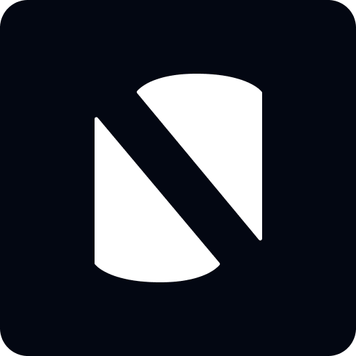

  <h1 align="center">NimbleEdge AI Assistant</h1>
  
  <h2 align="center">First fully on-device conversational assistant</h2>

  
  

**NimbleEdge AI Assistant** is a private, fully on-device conversational AI assistant. Built on the **DeliteAI platform**, it delivers secure, privacy-aware, and high-performance AI experiences without compromising your data or requiring internet connectivity.

## Key Features

### Complete Privacy & Security
- **Works without cloud processing** - All AI operations happen on your device
- **No internet dependency** - Works offline, perfect for travel and remote locations
- **Your data, your control** - Clear cache and it's like you never used it

### Powerful On-Device AI
- **Voice + Text Interface** - Natural conversational interactions
- **Speech-to-Text** - On-device voice input via Google ASR or Whisper Tiny
- **Intelligent Responses** - Powered by quantized Llama 3.2 1B Instruct model
- **Human-like Voice Output** - Custom Kokoro TTS model for natural speech synthesis

## Use Cases
- **Offline AI assistance** while flying or traveling
- **Privacy-first interactions** with AI for sensitive conversations
- **Off-grid knowledge access** during hiking or remote activities
- **Family-friendly AI** without surveillance or ads
- **Personal assistant** that's truly yours, not a proxy for business models

## Getting Started
Currently available on [Android](https://play.google.com/store/apps/details?id=ai.nimbleedge.nimbleedge_chatbot_)

iOS version coming soon!

## Technical Architecture

NimbleEdge AI Assistant leverages the DeliteAI platform's capabilities:
- **On-device Model Execution** via ONNX/ExecuTorch runtime
- **Quantized Models** for optimal performance and size
- **Custom C++ Engine** for seamless Python workflow execution
- **Kotlin/Swift Integration** for native mobile app performance

## Roadmap
- **iOS App Launch** - Coming soon
- **Tool Calling via MCP** - Seamless integration with device and consumer apps
- **Hardware Acceleration** - Auto-optimized runtime for best latency and power efficiency
- **Model Flexibility** - Support for Gemini Nano, Qwen, Llama, and custom models
- **Open Source Release** - Full AI assistant code and NimbleEdge SDK

## Community Engagement
We welcome any feedback or suggestions - please join our
[Discord](https://discord.gg/y8WkMncstk) to engage with the community.

## Contributing

We welcome contributions from the community!

Please read our [Contributing Guidelines](CONTRIBUTING.md) to get started.

## License

This project is licensed under the Apache License 2.0 - see the [LICENSE](LICENSE) file for details.

---

Learn more: [NimbleEdge AI Launch Blog](https://www.nimbleedge.com/blog/meet-nimbleedge-ai-the-first-truly-private-on-device-assistant)
